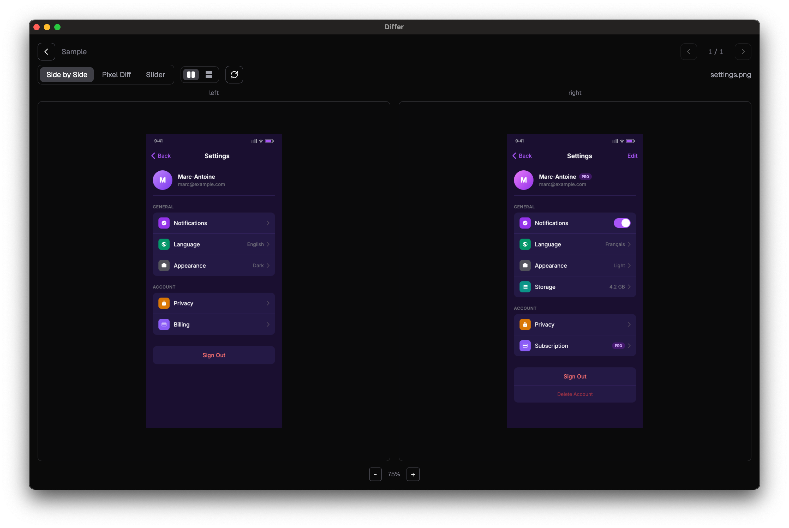

<div align="center">


# Differ

Desktop app for comparing images side-by-side with pixel-level diffing

[](https://github.com/maferland/differ/actions/workflows/ci.yml)
[](https://github.com/maferland/differ/releases/latest)



https://github.com/maferland/differ/raw/refs/heads/main/web/demo.mp4

</div>

---

Pick two folders, auto-match images by filename, and compare them with three modes:

- **Side-by-side** — Synchronized scroll and zoom, horizontal or vertical layout
- **Pixel diff** — pixelmatch-powered overlay with diff percentage
- **Slider** — Draggable overlay to reveal differences

Save folder pairs as named projects. Session auto-restores on relaunch.

## Install

```sh
brew install maferland/tap/differ
```

Or download the `.dmg` from [Releases](https://github.com/maferland/differ/releases/latest).

## Development

### Prerequisites

- [Node.js](https://nodejs.org/) 20+
- [Rust](https://www.rust-lang.org/tools/install) (latest stable)

```sh
git clone https://github.com/maferland/differ
cd differ
npm install
npm run tauri dev
```

### Build

```sh
npm run tauri build
```

Produces `.app` and `.dmg` in `src-tauri/target/release/bundle/`.

## Support

[](https://buymeacoffee.com/maferland)

## License

[MIT](LICENSE)
